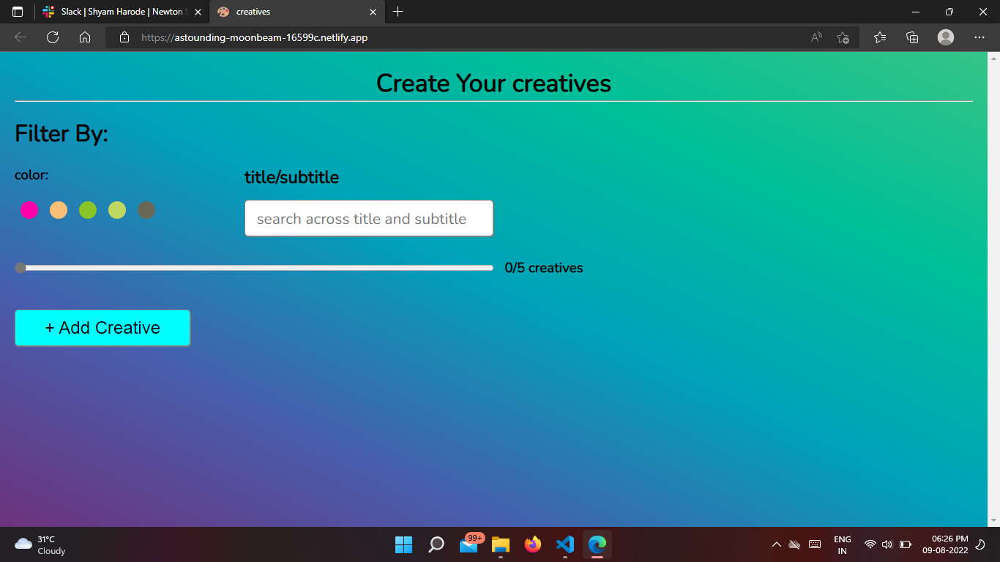

# Project Title - Creatives Page

## Description

- The Creative Page website helps to create content and user can choose background color according to given options.
- User can also filter Creatives according to title, subtitle or background color of the creative.
- Used API to fetch different background color.

### How to use

- To create new card click on Add creative button.
- Write title, subtitle and select a background color.
- Click on Done button
- User can add maximum 5 creative.
- Filter Creatives according to color or title/subtitle.

## Built With

Only HTML, CSS and JavaScript.

## Screenshots

## Deployment

the web app is deployed using Netlify. Live Link URL : https://astounding-moonbeam-16599c.netlify.app

## Authors

[@praveen bankhede](https://github.com/praveen1295)
 
Email-me: bankhedepraveen12@gmail.com
 
Connect with me at [Linkedin](https://www.linkedin.com/in/praveen1295)
